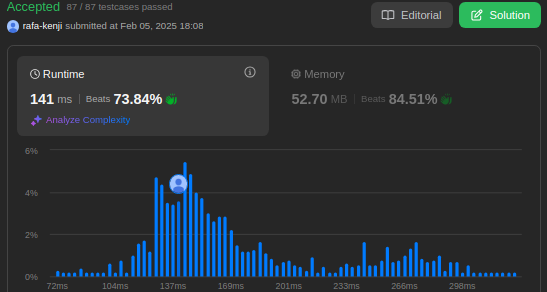
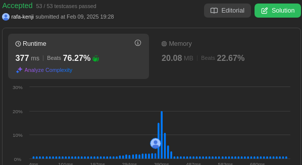

# LeetCode_Questoes

**Número da Lista**: 42 
**Conteúdo da Disciplina**: Programação Dinâmica 

## Alunos
|Matrícula | Aluno |
| -- | -- |
| 19/0044128  |  Rafael Kenji Taira |
| 22/2032810  |  Felipe Aguiar Hansen |

## Sobre 

Este projeto consiste em três códigos desenvolvidos para resolver questões específicas da plataforma LeetCode, utilizando programação dinâmica. O objetivo é oferecer soluções para problemas de média e alta dificuldade, abordando desafios como otimização de subproblemas, cálculo de subsequências, combinação de resultados e minimização/maximização de custos. Cada código é implementado em Python, aplicando técnicas de programação dinâmica para armazenar resultados intermediários e evitar cálculos repetitivos, garantindo eficiência e clareza nas soluções.

**Problemas**
|Código | Título | Dificuldade |
| -- | -- | -- |
| [474](https://leetcode.com/problems/ones-and-zeroes/description/) | Ones and Zeroes | Difícil |
| [354](https://leetcode.com/problems/russian-doll-envelopes/description/) | Russian Dolls Envelopes | Difícil |
| [743](https://leetcode.com/problems/network-delay-time/description/) | Network Delay Time | Médio |
## Screenshots
- Questão 474

- Questão 354

- Questão 743

## Uso 
**Linguagem**: Python 
Para verificar as resoluções das questões, copie a resolução da questão desejada que está dentro de sua respectiva pasta e cole na página de exercício do leetcode que tenha a questão ou no código na seção dos problemas apresentados anteriormente

## Video

### Questão Difícil 474: [Ones and Zeroes](https://youtu.be/TXU6_o7uuIY)
### Questão Difícil 354: [Russian Dolls Envelopes](https://youtu.be/99b5gP6VXys)
### Questão Difícil 743: [Network Delay Time](https://youtu.be/I2GGoI-eJ8o)